# Project for the web Accelerator
The Project for the web Accelerator applies useful customizations to the Project for the web Power App. The Accelerator can _easily_ be deployed to any environment that has Project for the web already in it. Scenarios included in the Accelerator are...

💡 **Project Requests**. Create a list of ideas for Projects that include a business case and expected impact. The included Power Automate flow will create projects whenever the state of requests is set to _Approved_.

💼 **Programs**. Create a heirarchy of programs and projects see how work fits into the bigger picture.

🔥 **Risks and Issues**. Manage the surprises that accompany every project. Create and assign risks and issues to minimize impacts to a project's schedule.

🚧 **Changes**. Use change tracking processes to help understand the history of a project.

📝 **Status**. Centralize recording of project status to keep stakeholders up-to-date.

This repository also contains a Power BI template that can be deployed alongside the Accelerator. For the best experience, deploy the Accelerator, then deploy the Power BI content pack, and finally, customize the Accelerator to use the deployed Power BI report. **Follow the instructions below to get started!**

---

### [Here's the latest version of the Accelerator](https://github.com/OfficeDev/Project-Accelerator/blob/main/releases/Project_for_the_web_Accelerator_v1_7_0_4.zip?raw=true)
### [Here's the latest version of the Power BI Template for the Accelerator](https://github.com/OfficeDev/Project-Accelerator/blob/main/releases/Project_for_the_Web_Accelerator_report_v1.1?raw=true)

---

### Important Notes about the latest release (v 1.7.0.4)

This release of the Accelerator includes a Power Automate flow that converts _Project Requests_ in an _Approved_ state into projects. To disable this flow, follow the instructions located later in this guide.

## Contents of this GitHub Repository

| File                                            | Description                                                                                                 |
| ----------------------------------------------- | ----------------------------------------------------------------------------------------------------------- |
| `README.md`                                     | This README file.                                                                                           |
| `LICENSE.md`                                    | Details about the MIT License for anyone looking to reuse code in this repository in their own applications |
| `releases`                                      | folder containing the Project for the web Accelerator                                                       |
| `Project for the web template.pbit`             | Power BI template for use with the Accelerator                                                              |

---

## Deploying the solution

### Prerequisites

- An environment with the Project for the web solution in it. [Learn more about deploying Project](https://docs.microsoft.com/project-for-the-web/deploying-project).
- Admin rights to the environment
- Rights to create Power Automate flows using the Common Data Service connector.

- A local copy of the [Accelerator](https://github.com/OfficeDev/Project-Accelerator/blob/main/releases/Project_for_the_web_Accelerator_v1_7_0_4.zip?raw=true). You don't need to unzip the solution file.

### Instructions

1. Sign into [powerapps.com](https://make.powerapps.com).
2. In the top header, open the _Environment_ menu and select the environment you have the Project solution installed in.
3. On the left navigation, click the _Solutions_ menu item.
4. Click on the _Import_ button in the top menu bar of this page.
5. In the popup, press the _choose file_ button and navigate to the local directory where you downloaded the `Accelerator` zip file.
6. Press _next_, and select an existing connection to a Power Automate flow or create a new one.
7. Press the _next_ button and then _import_ to begin importing the solution. This will take several minutes, so grab a coffee ☕.

**Once this has been completed you're done deploying the solution!**

The Project Power App in this environment will look similar to the screenshot below. If you want to make a change, you can deploy a managed solution with additional changes, or edit the Project Power App yourself in [PowerApps.com](https://make.powerapps.com).


## Converting a Project Request into a Project using Power Automate
The Accelerator helps teams take their ideas and turn them into projects. This is possible because a Power Automate flow is included in the solution.

To get started, create a new Project Request. New requests will be in a _New_ state. 

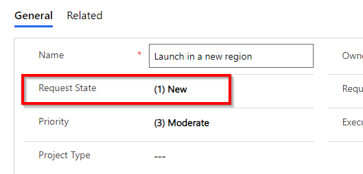

To create a project, change the state to _Approved_ and press the _Save_ button to save the record. In a few moments, a new project will appear in the list of projects.

### Customizing the flow
The flow included with the Accelerator is very simple: it creates a project from a request in an _Approved_ state. This can be customized to support scenarios such as including steps to send a notification to Teams. Customizing the flow starts in the Power Platform makers portal.
1. Open the Project for the Web Accelerator solution in make.powerapps.com
1. Look for the _When the request state is updated to Approved_ cloud flow
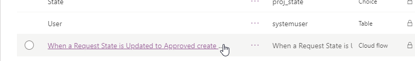 
1. Click on the label to open the flow in flow.microsoft.com
1. Edit the flow to support the workflows of the team
1. Save the Flow and close the browser tab
1. In the Power Apps makers portal, press the _Publish all customizations- button to persist changes to the flow
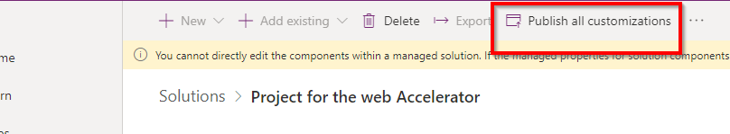

### Disabling the flow
The flow can be disabled from within the solution explorer.
Open the Project for the Web Accelerator solution in make.powerapps.com
1. Look for the _When the request state is updated to Approved_ cloud flow 
1. Press the "..." to open the menu for the flow
1. Select the _Turn Off_ menu option
1. At the top of the window, press the _Publish all customizations- button to persist changes to the flow
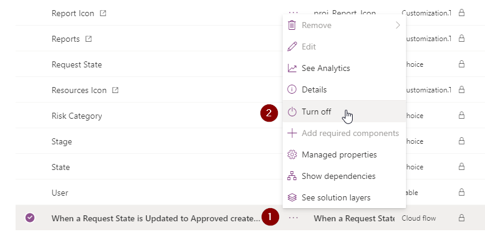

## Using the Power BI template

### Prerequisites

- An environment with Project for the web and the Project Accelerator in it.
- Admin rights to the environment
- The appropriate privileges to deploy the Power BI content pack to powerbi.com.

### Deploy the Power BI template

1. Download the [Power BI template](https://github.com/OfficeDev/Project-Accelerator/blob/main/releases/Project_for_the_Web_Accelerator_report_v1.1?raw=true) for the Accelerator.
2. Deploy it using Power BI Desktop or in the [PowerBI.com service](https://www.powerbi.com).
3. When prompted for the environment url, use the base url of your environment. For example: `https://myenvironment.crm.dynamics.com`

When you deploy the report, ensure that your team will have access to it. [Learn more about sharing in Power BI](https://docs.microsoft.com/power-bi/collaborate-share/service-share-dashboards).

### Modify the Project Accelerator to use the deployed template

The Accelerator already contains a placeholder for the Power BI template. Once you've deployed the Accelerator and the Power BI template, follow these steps to have the Power BI report appear in the Accelerator.

1. Once you've deployed the Power BI template, open the report in [PowerBI.com](https://www.powerbi.com).
2. Press the _Share_ button in the top navigation bar, open the _Embed report_ menu item, and then choose the _Website or portal_ option.

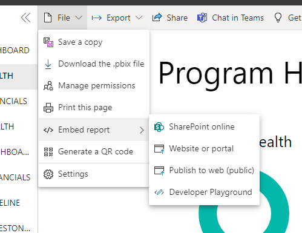

1. Copy the link in the top box ("Here's a link you can use to embed content") and keep it handy.


4. In a new browser tab, sign into [powerapps.com](https://make.powerapps.com).
5. In the top header, open the _Environment_ menu and select the environment you have the Project solution installed in.
6. On the left navigation, click the _Solutions_ menu item.
7. Click the _Project for the web Accelerator_ solution name to open the solution.


8. Click the _Reports_ item. It has the name _proj_Reports_ and is of type _Customization.Type_WebResource_.


9. In the new tab that opens, click the _Text Editor_ button in the _Content_ section of the page.

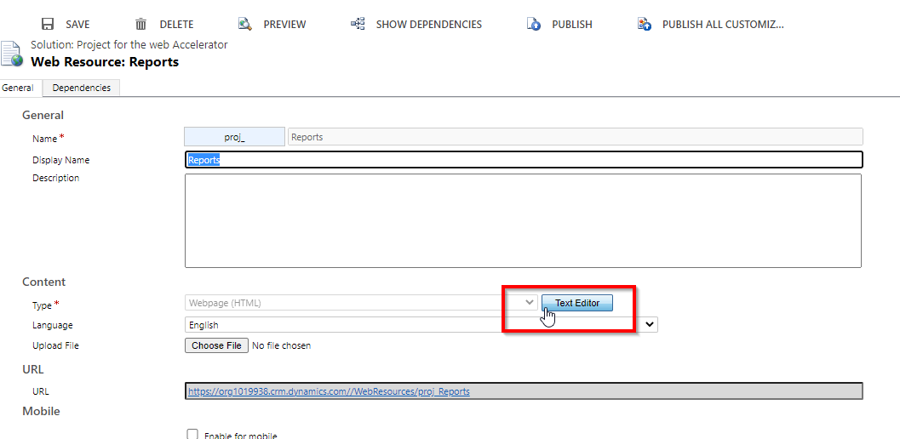

10. Switch to the _Source_ tab in the dialog that appears.


11. Delete the all the content in that text box and paste in the code snipped below. Replace the text between quotes `REPLACE THIS` with the link from step 3 that you created in the PowerBI.com site. Be sure to keep the quotes!

```
  <html>
    <head>
    </head>
    <body onfocusout="parent.setEmailRange();" style="overflow-wrap: break-word;">
      <iframe width="100%" height="100%" src="REPLACE THIS" frameborder="0" allowfullscreen="true"></iframe>
    </body>
  </html>
```

1.  Press _OK_ to save the changes and close the dialog.
2.  Press the _Save_ button and then the _Publish all customizations_ button to have the changes made. Once published, you can close the browser tabs.

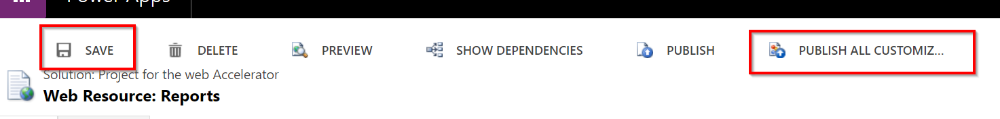

**You can now view the Power BI report within the Accelerator! Just open the Reports link in the left navigation of the Project Power App**

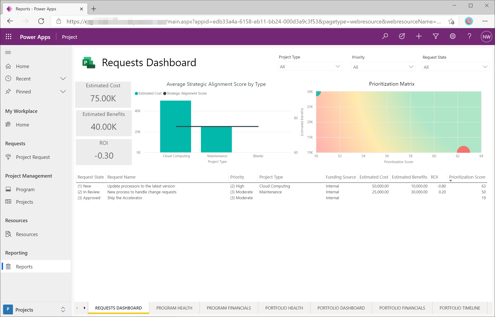

## Licensing

The Accelerator solution and Power BI template are distributed free of charge under the MIT license.
However, using them in your environments to work with _Project for the web_ has certain licensing implications.

Refer to the [Project Service Description](https://docs.microsoft.com/office365/servicedescriptions/project-online-service-description/project-online-service-description) for details about Project licensing.

### Using the Accelerator without the Power BI content pack

Using all the customizations -except the reports- requires a **Project Plan 1** license. This applies to your project managers who also need to do things like organize programs, track issues and risks, manage the business case and financials, or edit the custom columns such as corporate sponsor of the project.

Users who don't need to make any changes to the project and only need to view things like risks and issues need a **Microsoft 365 license**.

### Using the Accelerator with the Power BI content pack

Users who need to view the Power BI reports in the Project Accelerator need the following
1.  an M365 or Project Plan 1 license
2.  a Power BI license

### Using the Accelerator without using Project for the web

All the content on this site is completely free for you to reuse in your own applications. Refer to the [LICENSE](LICENSE) file for details. It is only when using the Accelerator with the Project Power App or when using the Project for the web tables that there are additional licensing implications.

## Support and Troubleshooting

For support of the Accelerator you can either raise an issue here in Github or open a new service request through the Microsoft 365 admin center Support tab. Microsoft fully support the deployment and use of the Accelerator with Project for the web, however we do not support any subsequent customizations that either you or a partner may have added on top of the Accelerator. We would of course still support the core functionality even if customizations have been added.

For best experience to avoid any issues with subsequent releases of the Accelerator always follow best practices of using managed solutions for any additional customization. [Learn about using solutions](https://docs.microsoft.com/powerapps/maker/data-platform/solutions-overview) and related documents for guidance on working with solutions and understanding correct use of solution layers.

### Errors about Dependencies
If you get an error (shown below) that you need a version of msdyn_ProjectServiceCore > 1.0.0.87, navigate to your list of solutions for your environment in [Power Apps](https://make.powerapps.com) and ensure that the latest version of the Project Service Core solution is installed. You'll see an "Update" option next to the solution name if there is an update available. After the update is complete, try installing the Accelerator package again.
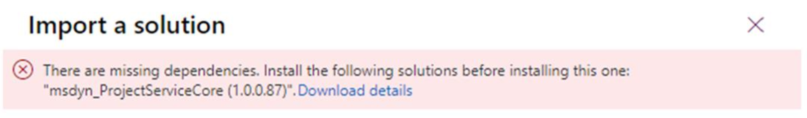

### Unable to turn on the flow for converting Project Requests into Projects
Some customers upgrading from an earlier version of the Accelerator may encounter one of these errors trying to turn on the flow.

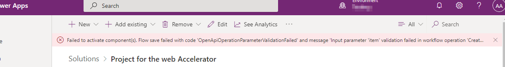

or this error in flow.microsoft.com

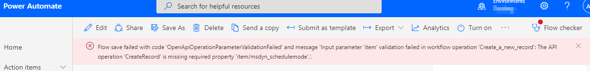

To resolve this, do the following.
1. In the Project Accelerator solution, open the flow by clicking on the label of the _When a Request State is Updated..._ cloud flow. This will open the flow.microsoft.com editor.
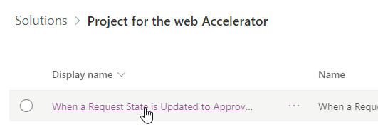
1. Press the Edit flow button
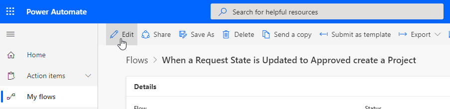
1. Click the _Condition_ step to expand it
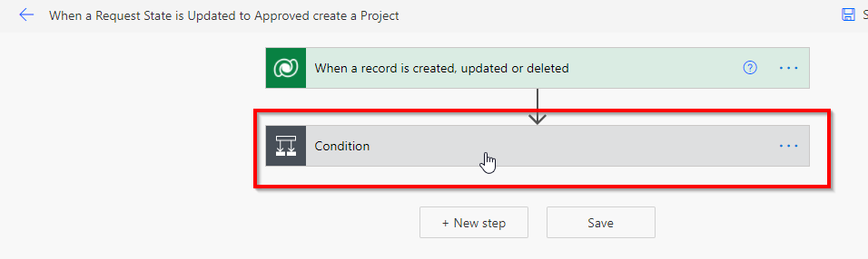
1. In the _If yes_ condition, expand the _Create a new record step_
1. Choose a value for the _Scheduling Mode_ field. Set it to _Fixed Duration_ if you're unsure of which scheduling mode you want. Don't leave it blank. [Learn more about scheduling modes](https://techcommunity.microsoft.com/t5/project-support-blog/schedule-modes-and-task-and-resource-usage-in-project-for-the/ba-p/2656738).
1. Press the save button to persist the changes
1. Press the back arrow at the top of the flow editor
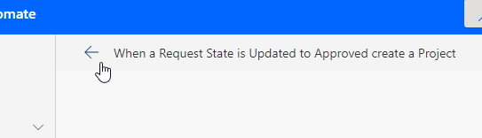
1. Press the _Turn On_ button to enable the flow
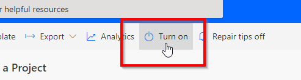
1. Close the browser tab to return to the Accelerator solution in make.powerapps.com
1. Press the _Publish customizations_ button at the top to persist the changes.
1. The flow should now work! To try it out, open a Project Request to the _Approved_ state and a project will be created