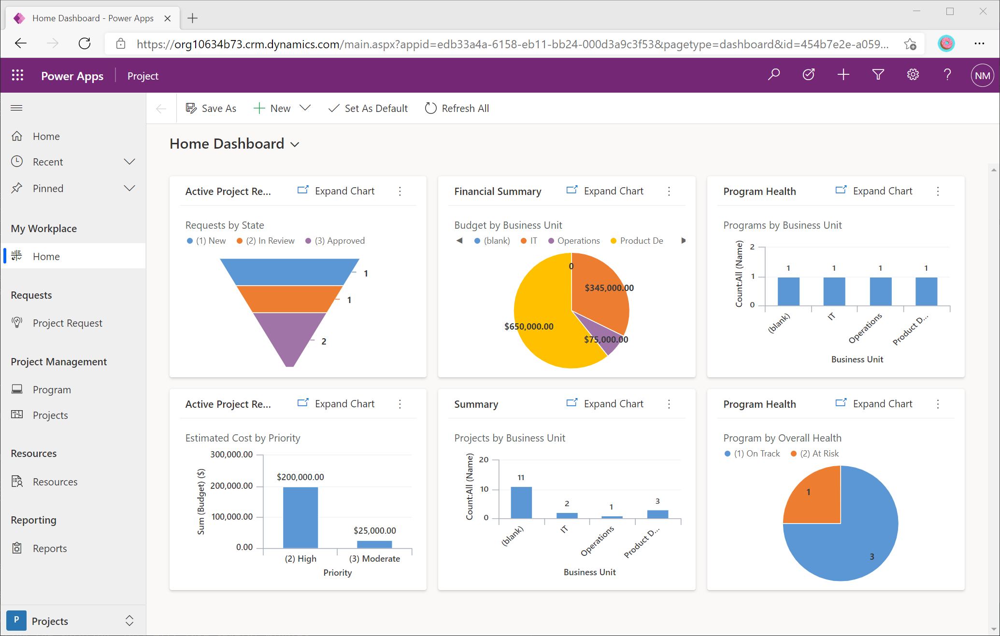
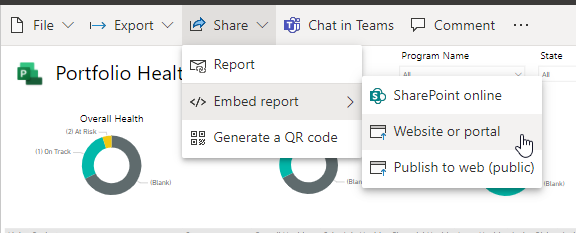
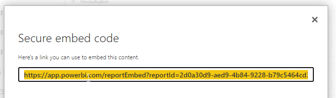
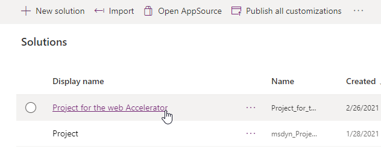
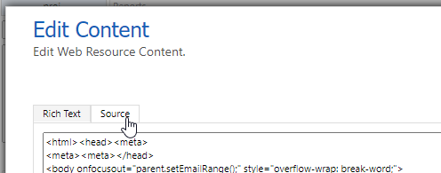

# Project for the web Accelerator

_NOTE: The content in this site is not a supported release of Microsoft software._

The Project for the web Accelerator applies useful customizations to the Project for the web Power App. The Accelerator can _easily_ be deployed to any environment that has Project for the web already in it. Scenarios included in the Accelerator are...

💡 **Project Requests**. Create a list of ideas for Projects that include a business case and expected impact. Pro-tip: Create an Approvals flow using Power Automate to convert Project Requests into Projects.

💼 **Programs**. Create a heirarchy of programs and projects see how work fits into the bigger picture.

🔥 **Risks and Issues**. Manage the surprises that accompany every project. Create and assign risks and issues to minimize impacts to a project's schedule.

🚧 **Changes**. Use change tracking processes to help understand the history of a project.

📝 **Status**. Centralize recording of project status to keep stakeholders up-to-date.

The Project Accelerator is completely customizable. If something is missing: add it! Sign into [PowerApps](https://make.powerapps.com) to make additional customizations to the Project Power App.

This repository also contains a Power BI template that can be deployed alongside the Accelerator. For the best experience, deploy the Accelerator, then deploy the Power BI content pack, and finally, customize the Accelerator to use the deployed Power BI report. **Follow the instructions below to get started!**

## Contents of this GitHub Repository

| File                                                 | Description                                              |
| ---------------------------------------------------- | -------------------------------------------------------- |
| `README.md`                                          | This README file.                                        |
| `LICENSE.md` | Details about the MIT License for anyone looking to reuse code in this repository in their own applications |
| `Project for the web Accelerator <version>.zip` | The Project for the web Accelerator |
| `Project for the web template.pbit`                  | Power BI template for use with the Accelerator |

_NOTE: The program management and business case scenarios are impacted by a critical bug in Project for the web. Until that bug is fixed, existing projects cannot be parented to programs and existing projects cannot be given business cases. We are working on a fix that will be available soon._

## Deploying the solution

### Prerequisites

* An environment with the Project for the web solution in it. [Learn more about deploying Project](https://docs.microsoft.com/project-for-the-web/deploying-project).
*  Admin rights to the environment
*   Rights to create Power Automate flows using the Common Data Service connector.
*   A local copy of the [Accelerator](Project%20for%20the%20web%20Accelerator%20Full%20v1_6_0_12.zip). You don't need to unzip the solution file.

### Instructions

1. Sign into [powerapps.com](https://make.powerapps.com).
2. In the top header, open the *Environment* menu and select the environment you have the Project solution installed in.
3. On the left navigation, click the *Solutions* menu item.
4. Click on the *Import* button in the top menu bar of this page.
5. In the popup, press the *choose file* button and navigate to the local directory where you downloaded the `Accelerator` zip file.
6. Press *next*, and select an existing connection to a Power Automate flow or create a new one.
7. Press the *next* button and then *import* to begin importing the solution. This will take several minutes, so grab a coffee ☕.

**Once this has been completed you're done deploying the solution!**

The Project Power App in this environment will look similar to the screenshot below. If you want to make a change, you can deploy a managed solution with additional changes, or edit the Project Power App yourself in [PowerApps.com](https://make.powerapps.com).

 

## Deploying the Power BI template

### Prerequisites

* An environment with Project for the web and the Project Accelerator in it.
* Admin rights to the environment
* The appropriate privileges to deploy the Power BI content pack to powerbi.com.

### Instructions to deploy the Power BI template
1. Download the [Power BI template](Project%20for%20the%20Web%20Accelerator%20report.pbit) for the Accelerator.
2. Deploy it using Power BI Desktop or in the [PowerBI.com service](https://www.powerbi.com).
3. When prompted for the environment url, use the base url of your environment. For example: `https://myenvironment.crm.dynamics.com`

When you deploy the report, ensure that your team will have access to it. [Learn more about sharing in Power BI](https://docs.microsoft.com/power-bi/collaborate-share/service-share-dashboards).

### Instructions to modify the Project Accelerator to use the deployed template
The Accelerator already contains a placeholder for the Power BI template. Once you've deployed the Accelerator and the Power BI template, follow these steps to have the Power BI report appear in the Accelerator.

1. Once you've deployed the Power BI template, open the report in [PowerBI.com](https://www.powerbi.com).
2. Press the *Share* button in the top navigation bar, open the *Embed report* menu item, and then choose the *Website or portal* option.



1. Copy the link in the top box ("Here's a link you can use to embed content") and keep it handy.



4. In a new browser tab, sign into [powerapps.com](https://make.powerapps.com).
5. In the top header, open the *Environment* menu and select the environment you have the Project solution installed in.
6. On the left navigation, click the *Solutions* menu item.
7. Click the *Project for the web Accelerator* solution name to open the solution.
  


8. Click the *Reports* item. It has the name *proj_Reports* and is of type *Customization.Type_WebResource*.


9. In the new tab that opens, click the *Text Editor* button in the *Content* section of the page.


10. Switch to the *Source* tab in the dialog that appears.



11. Delete the all the content in that text box and paste in the code snipped below. Replace the text between quotes `REPLACE THIS` with the link from step 3 that you created in the PowerBI.com site. Be sure to keep the quotes!

```
  <html>
    <head>
    </head>
    <body onfocusout="parent.setEmailRange();" style="overflow-wrap: break-word;">
      <iframe width="100%" height="100%" src="REPLACE THIS" frameborder="0" allowfullscreen="true"></iframe>
    </body>
  </html>
```

1.  Press *OK* to save the changes and close the dialog.
2.  Press the *Save* button and then the *Publish all customizations* button to have the changes made. Once published, you can close the browser tabs.


**You can now view the Power BI report within the Accelerator! Just open the Reports link in the left navigation of the Project Power App**


## Licensing

The Accelerator solution and Power BI template are distributed free of charge under the MIT license.
However, using them in your environments to work with *Project for the web* has certain licensing implications.

Refer to the [Project Service Description](https://docs.microsoft.com/office365/servicedescriptions/project-online-service-description/project-online-service-description) for details about Project licensing.

### Using the Accelerator without the Power BI content pack 

If you just deploy the Accelerator without the Power BI content pack, users will need the following licenses.

Making full use of all the customizations requires a **Project Plan 3** license. This applies to your project managers who also need to do things like organize programs, track issues and risks, manage the business case and financials, or edit the custom columns such as corporate sponsor of the project.

Users only need a **Project Plan 1 license** if they only need to manage tasks in the Task Tab or make changes to core project fields (Project Name, Project Owner, Estimated Start Date, and Calendar Template). These users have view rights to the rest of the fields and tables in the app.

Users who don't need to make any changes to the project only need a **Microsoft 365 license**.

### Using the Accelerator with the Power BI content pack

Users who need to view the Power BI reports in the Project Accelerator need a **Project Plan 3 as well as a Power BI license**.

### Using the Accelerator without using Project for the web
All the content on this site is completely free for you to reuse in your own applications. Refer to the [LICENSE](LICENSE) file for details. It is only when using the Accelerator with the Project Power App or when using the Project for the web tables that there are additional licensing implications.